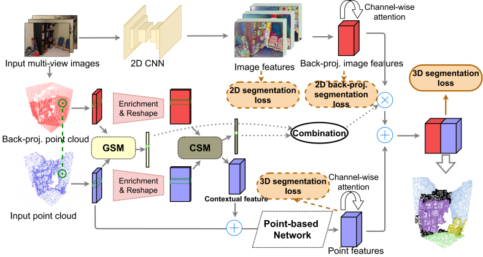

# SAFNet
Implementation of [Similarity-Aware Fusion Network for 3D Semantic Segmentation](https://arxiv.org/abs/2107.01579) IROS 2021



## Environment Preparation & Data Preparation

We prepared our environment and [ScanNet data](http://kaldir.vc.in.tum.de/scannet_benchmark/) as follows: 

Environment: 

  - Python 3.6
  - Pytorch 1.2.0
  - CUDA 10.0 & CUDNN 7.6.4
 
DATA: 

  - The data is released under the [ScanNet Term of Use](http://kaldir.vc.in.tum.de/scannet/ScanNet_TOS.pdf), please contact ScanNet team for access.
  - See [MVPNet](https://github.com/maxjaritz/mvpnet) repo for processing the raw data and resizing images.

<!-- ## Training -->

<!-- Pre-train 2D networks on the 2D semantic segmentation task.
```bash
python mvpnet/train_2d.py --cfg configs/scannet/unet_resnet34.yaml
```
 -->
 **Currently, the code is not clean.**
 
 The code is coming soon.
 
 ## Pre-trained Model
 
 We provide a pre-trained model which achieves **68.54% mIoU** and **88.07% Accuracy** on the validation set of ScanNetv2.
 
 The validation log was written in [this file](./log.test.07-07_22-52-27.ivg-221.txt).
 
 Please check the [BaiduDisk](https://pan.baidu.com/s/1-0TTaVea42OHyh8Z1tBBvw) with the code [f4n6].
 
 
## Core code

To see the corest part of our method, you can directly check [this file](./safnet/models/safnet_3d_late_fusion_attention_linear_mapping.py).
 
## Acknowledgements
We thank the authors of following works for opening source their excellent codes.

  - [MVPNet](https://github.com/maxjaritz/mvpnet)

  - [PointNet2](https://github.com/charlesq34/pointnet2)

# Citation
If you find our work useful, please cite our [paper](https://arxiv.org/abs/2107.01579):
```
@article{2107.01579,
Author = {Linqing Zhao and Jiwen Lu and Jie Zhou},
Title = {Similarity-Aware Fusion Network for 3D Semantic Segmentation},
Year = {2021},
journal={arXiv preprint arXiv:2107.01579},
}
```
